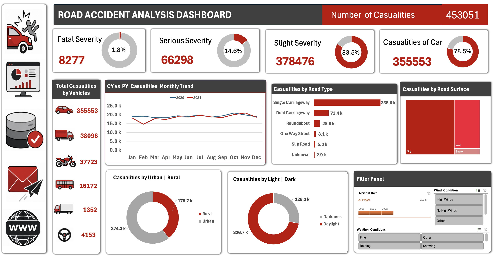

# 🚗💥 Road Accident Analysis Dashboard

## 📌🔍 Project Overview

This project presents an interactive **Road Accident Analysis Dashboard** created in **Microsoft Excel**.

The purpose of this project is to analyze road accident casualty data and identify important patterns related to accident severity, vehicle type, road type, road surface, urban and rural areas, light conditions, and monthly trends.

The original dataset was cleaned and transformed before building the dashboard.

---

## 🛠️📊 Tools and Techniques Used

- 🟩 Microsoft Excel
- 🧹 Data Cleaning
- 🔄 Data Transformation
- 📋 PivotTables
- 📈 PivotCharts
- 🎛️ Slicers
- 🗓️ Timeline Filters
- 🔢 KPI Cards
- 🍩 Donut Charts
- 📉 Line Charts
- 📊 Bar Charts
- 🧩 Treemap Charts
- 🎨 Dashboard Design and Formatting

---

## 🖼️📊 Dashboard Preview



---

## 🔢🚦 Key KPIs

- 🚨 **Total Casualties:** 453,051
- ☠️ **Fatal Casualties:** 8,277
- ⚠️ **Serious Casualties:** 66,298
- 🟡 **Slight Casualties:** 378,476
- 🚗 **Car Casualties:** 355,553

---

## 📈🔎 Dashboard Analysis

The dashboard analyzes:

- 🚨 Casualties by severity
- 🚗 Casualties by vehicle type
- 🛣️ Casualties by road type
- 🌧️ Casualties by road surface
- 🏙️ Urban vs rural casualties
- ☀️🌙 Daylight vs darkness casualties
- 📅 Monthly casualty trends
- 📊 Current year vs previous year performance
- 🗓️ Accident date
- 📆 Day of the week

---

## 💡📌 Key Insights

- 🟡 **Slight casualties** account for **378,476 casualties**, representing **83.5%** of total casualties.

- 🚗 **Cars** contribute **355,553 casualties**, which is **78.5%** of the total.

- 🛣️ **Single carriageways** record **334,988 casualties**, representing **73.9%** of total casualties.

- 🌤️ **Dry roads** account for **298,382 casualties**, while wet roads account for **137,690 casualties**.

- 🏙️ **Urban areas** record **274,329 casualties**, compared with **178,709 casualties** in rural areas.

- ☀️ **Daylight conditions** account for **326,748 casualties**, representing **72.1%** of total casualties.

- 📅 **October** has the highest monthly casualty count with **41,138 casualties**, followed closely by **November with 40,880 casualties**.

- 📉 Total casualties decreased from **230,905 in 2020** to **222,146 in 2021**, a decrease of **3.8%**.

---

## ✅🛡️ Recommendations

- 🚗 Focus road-safety campaigns on **car drivers**, as cars contribute the largest share of casualties.

- 🛣️ Improve safety measures on **single carriageways** through better speed control, road signs, lane markings, and enforcement.

- 🏙️ Strengthen road-safety measures in **urban areas**, where casualty levels are higher than in rural areas.

- 📅 Increase safety awareness and monitoring during **October and November**, when casualty levels are highest.

- ☀️🌧️ Do not focus only on poor weather conditions. Most casualties happen on **dry roads and during daylight**, so everyday driving behaviour should remain a major safety priority.

---

## 📂🗂️ Project Structure

```text
Road-Accident-Analysis/
│
├── 📁 data/
│   ├── raw/
│   └── processed/
│
├── 🎨 icons/
│
├── 🖼️ images/
│   ├── road_accident_dashboard.png
│   └── pivot_kpi_database.png
│
├── 📊 Road_Accident_Analysis_Dashboard.xlsx
├── 📄 Road_Accident_Analysis_Insights.pdf
└── 📘 README.md